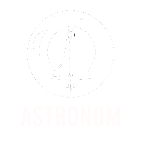

# Prototype for Astronom

This is a straightforward prototype website for Astronom that was made with JavaScript, CSS, and plain HTML. The website offers details about the brand and displays a variety of current or upcoming space programs.

**Technologies Used**
- HTML: The format and information on web pages.
- CSS: The website's styles and design.
- JavaScript: Dynamic functionality and interactivity.
  
## Regarding the Website
The website for Vorskin Beauty is used as a prototype to show how the brand's online presence would look and function. It offers a straightforward and user-friendly interface to display their cosmetics. The following sections are on the website:

- Home: A summary of an introduction to the company and the company's ongoing or future space projects.
- Hawk 11: Showing of the capability and features of the Hawk 11 rocket made by the company.
- Superhawk : Showing of the capability and features of the Super Hawk rocket made by the company .
- Wyvern : Showing of the capability and features of the Wyvern Shuttle made by the company.
- Human Space Travel : Form where users can sign up for the upcoming Human Space Travel program by the company.
  
## Author
Vincen Elfan Tananjaya is the creator of this website prototype. It functions as a simple prototype to display the layout and features of Astronom's web presence.

